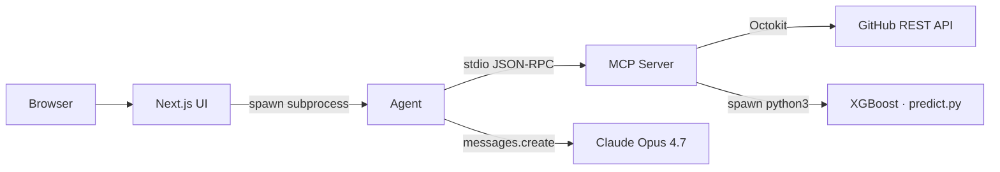

# PRInsight
> AI-Powered GitHub PR Intelligence Agent

**Live Demo:** _Coming after deployment_

## 🎯 What It Does

PRInsight ingests a GitHub repository's recent activity — 90 days of PR history, 6 months of commit-level code ownership, and per-author velocity signals — and turns it into an executive briefing for engineering managers. It also classifies individual PRs into LOW / MEDIUM / HIGH merge-time risk using an XGBoost model trained on real PRs across five major OSS projects, and ranks the most-relevant reviewers by their code-ownership of the changed files.

## ✨ Key Features

- **Repository team analysis** — 90-day PR survey + bus-factor proxy + Claude-synthesized recommendations
- **PR merge-time prediction** — XGBoost classifier (68% accuracy, F1 0.57) with calibrated class probabilities
- **Owner-aware reviewer suggestions** — top-3 reviewers ranked by ownership + recency, with PR author and bots filtered out
- **Executive briefings** — Claude Opus 4.7 turns raw tool output into a markdown report you can paste into a 1:1

## 🏗️ Architecture

### System Components

1. **MCP Server** (TypeScript) — `mcp-server/`
   - 5 custom tools: `analyze_pr_history`, `get_code_ownership`, `get_team_metrics`, `predict_pr_risk`, `suggest_reviewers`
   - `@octokit/rest` with automatic exponential backoff on rate-limit responses
   - In-memory 1-hour cache on `code_ownership` (prevents 5-15 min recomputation per call)

2. **ML Model** (Python / XGBoost) — `ml-model/`
   - 3-class XGBoost classifier (LOW / MEDIUM / HIGH risk)
   - Trained on 596 PRs (621 collected; 25 filtered as >30-day stale outliers) from 5 popular OSS repos
   - Accuracy 68% · Macro F1 0.57 · LOW-class F1 0.80
   - Features: file count, lines changed, commits, has_tests, time-of-day, day-of-week, author PR count, review count, repo (one-hot)

3. **Agent Orchestration** (TypeScript) — `agent/`
   - Custom MCP client speaking raw JSON-RPC 2.0 over the server's stdio transport
   - Claude Opus 4.7 for synthesis (`thinking: "adaptive"`, `effort: "high"`)
   - Multi-step workflows: PR history → metrics → ownership → Claude

4. **Demo UI** (Next.js 14) — `ui/`
   - App Router · React 18 · Tailwind CSS
   - Dark navy/teal theme with glassmorphism
   - Server-side API routes spawn the agent subprocess and stream stdout back

### Data Flow



## 🚀 Getting Started

### Prerequisites
- Node.js 20+
- Python 3.10+
- GitHub Personal Access Token (`repo` scope is enough for public repos)
- Anthropic API Key

### Installation

```bash
# Clone repository
git clone https://github.com/ssmubc/prinsight.git
cd prinsight

# Install MCP server dependencies
cd mcp-server
npm install
cd ..

# Install ML model dependencies
cd ml-model
pip3 install -r requirements.txt --break-system-packages
cd ..

# Install agent dependencies
cd agent
npm install
cd ..

# Install UI dependencies
cd ui
npm install
cd ..

# Configure environment variables
cp .env.example .env
# Edit .env with your API keys
```

### Configuration

Create `.env` in the project root, `mcp-server/`, `agent/`, and `ui/`:

```env
ANTHROPIC_API_KEY=sk-ant-api03-your-key-here
GITHUB_TOKEN=ghp_your-token-here
```

### Running the Application

**Option 1: Full UI (recommended for demo)**
```bash
cd ui
npm run dev
# Open http://localhost:3000
```

**Option 2: CLI (faster for development)**
```bash
# Analyze a repository
cd agent
node --loader ts-node/esm index.ts analyze vuejs/core

# Predict a PR
node --loader ts-node/esm index.ts predict vuejs/core 14867
```

### Retraining the ML Model

```bash
# Collect fresh training data (5 repos × 30 days; ~10 min, ~500 API calls)
cd mcp-server
npm run collect-data

# Retrain
cd ../ml-model
python3 train.py
```

## 📊 ML Model Performance

| Metric                   | Value |
| ------------------------ | ----- |
| Overall accuracy         | 68.3% |
| Macro F1                 | 0.57  |
| LOW-risk F1              | 0.80  |
| MEDIUM-risk F1           | 0.70  |
| HIGH-risk F1             | 0.21  |
| Training examples (post-filter) | 596 |
| Baseline (majority class)| 43.5% |

**Training data:** 621 merged PRs from `vercel/next.js`, `facebook/react`, `microsoft/typescript`, `nodejs/node`, and `vuejs/core` over a 30-day window. 25 PRs with merge times > 30 days were filtered as stale-but-eventually-merged outliers, leaving 596 for training.

**Top feature importances** (XGBoost):

| Feature | Importance |
| --- | --- |
| `repo_nodejs_node`        | 0.41 |
| `repo_vuejs_core`         | 0.11 |
| `review_count`            | 0.07 |
| `author_pr_count`         | 0.06 |
| `total_lines_changed`     | 0.05 |

**Key insight:** repo identity dominates the feature importances — different OSS projects have fundamentally different review cultures. Code-shape features (lines changed, file count) provide marginal additional lift. The HIGH-risk class is under-predicted (recall 15%) due to class imbalance; a real production model would either use `class_weight="balanced"` or collect more HIGH-class examples.

## 🛠️ Tech Stack

**Backend**
- TypeScript · Node.js 20
- Model Context Protocol (MCP) — custom JSON-RPC server
- `@octokit/rest` (GitHub API)
- Python 3 · XGBoost · scikit-learn · pandas

**Frontend**
- Next.js 14 (App Router)
- React 18
- Tailwind CSS · `@tailwindcss/typography`
- `react-markdown` · `remark-gfm`
- `lucide-react` icons

**AI / ML**
- Claude Opus 4.7 (adaptive thinking, high effort)
- XGBoost multi-class classifier
- Anthropic SDK · MCP SDK protocol

## 📸 Screenshots

_Screenshots coming soon — landing, analyze flow, and predict-with-risk-badge views._

## 🎓 What I Learned

**ML insights**
- The first regression approach gave **R² = −0.38** — worse than predicting the mean. Adding `repo` as a one-hot feature actually made R² worse on a different test split, even though MAE improved by 7 hours.
- Pivoting to classification (LOW / MEDIUM / HIGH) recovered usable signal: **68% accuracy, 0.80 F1 on LOW**. The reframing accepted that we can't predict exact merge time, but we *can* triage PRs into reasonable buckets.
- Predicting human review behavior from code-shape features alone has a hard ceiling. Reviewer availability, PR description quality, CI status, and team norms dominate — none of which are visible in the raw GitHub metadata I used.

**Engineering decisions**
- Built a **raw JSON-RPC MCP client** in the agent rather than using the official SDK client. Same wire format, but it explicitly demonstrates the protocol (`initialize` handshake, `notifications/initialized`, line-delimited JSON-RPC over stdio) — better portfolio signal than an SDK call.
- **Ownership caching with 1-hour TTL** turned the reviewer-suggestion tool from "unusable" (5-15 min per call) to "instant after first call per repo". Required ~15 LoC.
- **Adaptive thinking + `effort: "high"`** on Claude Opus 4.7 for analysis quality. Cost ~$0.15-0.25 per `analyze` call, but the synthesis quality is meaningfully better than Sonnet on this kind of multi-source reasoning.

**Trade-offs I'd revisit**
- Synchronous long-running HTTP requests vs. SSE streaming with real progress events — for a real deployment, the 5-15 minute wait on `analyze` is a non-starter
- One global cross-repo model vs. per-repo models — repo identity is the strongest signal, so per-repo training would likely beat the unified model
- Inference-time `author_pr_count` is computed differently than at training time (per-repo via GitHub search vs. across-the-training-set). This distribution shift may hurt accuracy

## 🚧 Future Improvements

- [ ] Server-Sent Events for real-time progress in the UI (kill the 15-min spinner)
- [ ] Per-repo classifiers — accept that team cultures differ instead of fighting it
- [ ] GitHub App with webhook triggers, so PRs get auto-analyzed on open
- [ ] Historical trend dashboards — merge-time velocity over quarters
- [ ] Class-balanced training (`class_weight="balanced"`) to fix HIGH-class recall
- [ ] Stronger features: target-encoded `author_avg_merge_time`, `repo_avg_merge_time`, `is_weekend`, `pct_test_files`

## 📝 License

MIT

## 👤 Author

**Sharon Marfatia**
- GitHub: [@ssmubc](https://github.com/ssmubc)
- LinkedIn: _Your LinkedIn URL_

---

_Built as a portfolio project demonstrating MCP protocol expertise, ML engineering, agent orchestration, and full-stack development._
